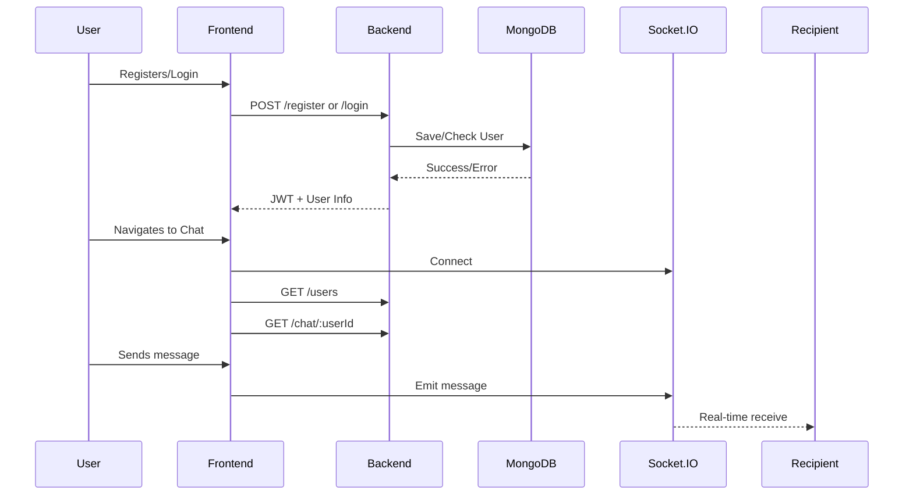
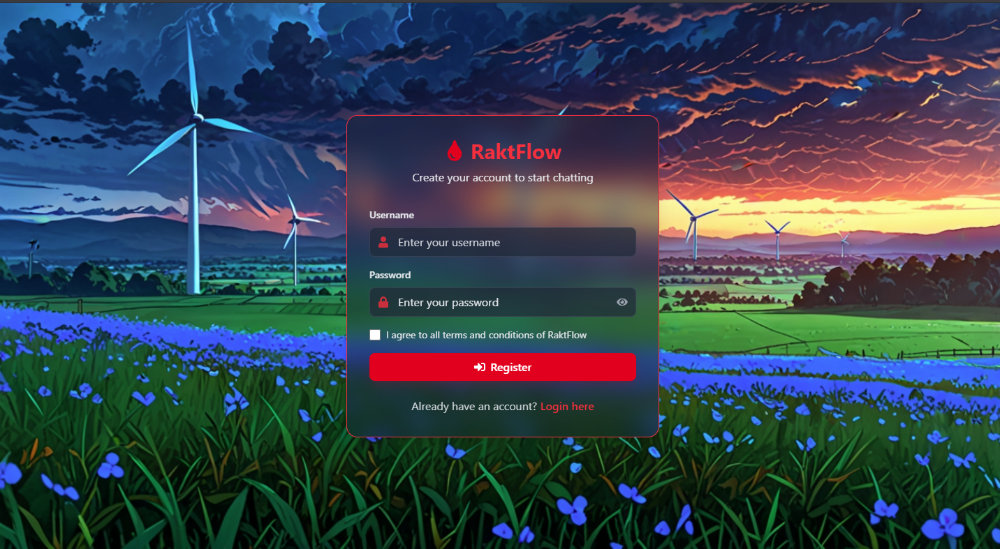
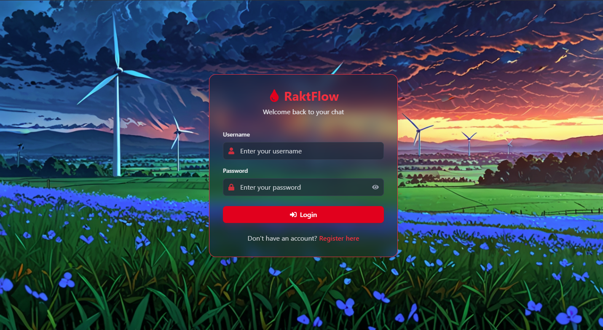
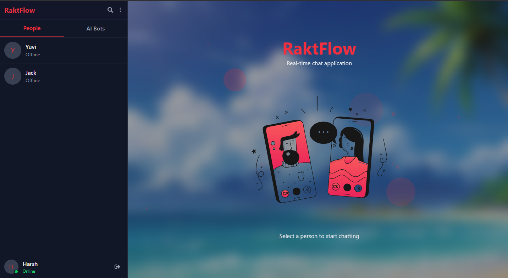
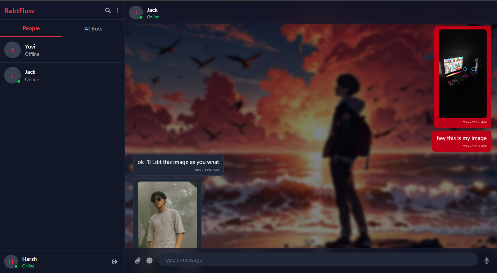

# 🩸 RaktFlow - Private Realtime 1v1 Chat App [](https://choosealicense.com/licenses/mit/)


**RaktFlow** is a secure, real-time SaaS chat platform designed for private 1v1 conversations — fast, encrypted, and minimal. Featuring seamless login, intelligent user discovery, and an integrated AI chatbot system powered by **EndGaming AI API** , RaktFlow offers users a unique blend of privacy, speed, and smart interaction. Whether you're chatting with friends or engaging in deep conversations with bots, your messages stay yours — always private, always flowing.

[](https://reactjs.org)
[](https://nodejs.org)
[](https://www.mongodb.com)
[](https://socket.io/)

---

## 📌 Table of Contents

- [Features](#-features)
- [Tech Stack](#-tech-stack)
- [System Flow](#-system-flow)
- [Installation](#-installation)
- [Usage Guide](#-usage-guide)
- [Screenshots](#-screenshots)
- [Deployment](#-deployment)
- [AI Bot Example](#-ai-bot-example)
- [Roadmap](#-roadmap)
- [License](#-license)
- [Contact](#-contact)

---

## ✨ Features

| Feature                 | Description                                                            |
| ----------------------- | ---------------------------------------------------------------------- |
| 🔐 **Authentication**   | Unique username and password registration & secure login/logout system |
| 👥 **User List**        | View all existing users on the platform                                |
| 🔎 **Search Users**     | Easily search users by username                                        |
| 🤖 **AI Bots Tab**      | Chat with AI-powered bots in a separate section                        |
| 💬 **1v1 Private Chat** | True private messaging with no third-party visibility                  |
| 🔁 **Persistent Login** | Re-login anytime with your registered credentials                      |
| 🔓 **Logout Anytime**   | Easily logout and return to login screen                               |

---

## 🛠 Tech Stack

**Frontend:**

- React.js (Vite)
- Tailwind CSS
- Axios
- Context API (for state management)
- Socket.IO-client
- React Router Dom (for routing)

**Backend:**

- Node.js
- Express.js
- MongoDB (Mongoose)
- Socket.IO (WebSockets)
- JWT (Authentication)
- Bcrypt (Password hashing)

---

## 🔁 System Flow



---

## 🧰 Installation

### 📦 Prerequisites

- Node.js v18+
- MongoDB Atlas or Local MongoDB
- (Optional) AI API Key for chatbot

### 📁 Backend Setup

```bash
git clone https://github.com/201Harsh/RaktFlow.git
cd RaktFlow/Backend
npm install
cp .env
npm run dev
```

### 💻 Frontend Setup

```bash
cd ../Frontend
npm install
cp .env
npm run dev
```

---

## 🧑‍💻 Usage Guide

1. Register using a unique username and password
2. Get redirected to the chat page
3. Search users and start private chats
4. Switch to the AI Bots tab to chat with AI
5. Logout and login again anytime

---

## 🖼 Screenshots

> See the Screenshots Below

### Register and Login Page





### Chat Page






---

## 🚀 Deployment

**Render:**

- Backend: Deploy Express server and MongoDB URI in environment variables
- Frontend: Build with `npm run build` and serve using static hosting

**Vercel:**

- Frontend only (connect to backend API via HTTPS)

**MongoDB Atlas:**

- Use cloud database connection string

---

# 🤖 AI Bot Integration (EndGaming AI)

This guide shows how to integrate the **EndGaming AI API** with your RaktFlow backend to enable real-time AI-powered chatbot interactions.

---

## 📦 Setup

Ensure you have the following dependencies installed in your backend project:

```bash
npm install express axios dotenv
```

---

## 🔐 Environment Variable

Create or update your `.env` file with your EndGaming AI API key:

```env
ENDGAMING_AI_KEY=your_actual_api_key_here
```

---

## 🚀 Example Route

Here's a sample route for handling AI-powered replies using **EndGaming AI API**:

```js
// backend/routes/ai.js
const express = require("express");
const router = express.Router();
const axios = require("axios");

router.post("/bot-reply", async (req, res) => {
  try {
    const { prompt } = req.body;

    const response = await axios.post(
      "https://api.endgamingai.com/v1/chat",
      {
        prompt,
        model: "endgaming-gpt",
        temperature: 0.7,
        maxTokens: 150,
      },
      {
        headers: {
          Authorization: `Bearer ${process.env.ENDGAMING_AI_KEY}`,
          "Content-Type": "application/json",
        },
      }
    );

    res.json({ reply: response.data.reply });
  } catch (error) {
    console.error("AI Bot Error:", error.message);
    res.status(500).json({ error: "Failed to get AI response" });
  }
});

module.exports = router;
```

---

## 💡 Notes

- You can adjust `temperature`, `model`, or `maxTokens` for different response behavior.
- Consider adding rate limiting and fallback responses in case of failure.

Enjoy building smarter chatbots with **EndGaming AI**!

---

## 🛣 Roadmap

A glance at what's built, what's brewing, and what's coming soon:

---

### ✅ Completed

- ✅ **Chat UI Cleanup** – Minimal, sleek interface for better usability
- ✅ **User Search & AI Tabs** – Switch between human chats and bots seamlessly
- ✅ **Chatbot Integration (Basic)** – Initial integration with EndGaming AI API

---

### 🚧 In Progress / Planned

- 🔐 **End-to-End Encryption** – Ensure full message privacy with E2EE protocols
- 📂 **Chat History Storage** – Save and retrieve past conversations
- 🌐 **Typing Indicators & Online Status** – Real-time awareness of user activity
- 📎 **File & Media Sharing** – Allow images, PDFs, and more in chats
- 🔔 **Notifications** – Browser and in-app message alerts
- 🧠 **Advanced AI Bot Features** – Contextual memory, personalized replies
- 🌍 **Internationalization (i18n)** – Support for multiple languages
- 📱 **Mobile Optimization** – Fully responsive mobile experience
- 📊 **Admin Dashboard** – Manage users, bots, and conversations
- 🧪 **Unit & Integration Tests** – Robust testing coverage for stability

---

# 🤝 Contributing to RaktFlow

We welcome all contributions to make **RaktFlow** even better! Whether you're fixing bugs, improving the UI, enhancing chatbot logic, or adding new features — your help is valued and appreciated.

---

## 🛠 How to Contribute

1. **Fork the repository**
2. **Clone your fork to your local machine**

```bash
git clone https://github.com/201Harsh/RaktFlow.git
```

3. **Create a new branch for your feature/fix**

```bash
git checkout -b feature/YourFeatureName
```

4. **Make your changes and commit**

```bash
git commit -m "Add: Description of your feature"
```

5. **Push to your branch**

```bash
git push origin feature/YourFeatureName
```

6. **Open a Pull Request** on the main repo with a clear description of what you’ve done.

---

## 🧪 Contribution Ideas

- 🧱 Add support for emojis, images, or file sharing
- 🔐 Implement more end-to-end encryption
- 🤖 Improve AI bot responses using GPT/Gemini API
- 🧑‍🎨 Refactor or redesign UI components (Tailwind + Plan CSS)
- 💬 Add message read receipts or typing indicators
- 🌍 Add internationalization / localization support
- 🌐 Add User's Online/Offline Feature

---

## 📜 Guidelines

- Follow consistent code style (Prettier + ESLint recommended)
- Keep PRs small and focused
- Add clear, meaningful commit messages
- Document your changes where necessary

---

# Live Preview
 - see the site live at

---

## 📃 License

```text
MIT License
Copyright (c) 2025 Harsh
Permission is hereby granted, free of charge, to any person obtaining a copy...
```

---

## 📮 Contact

- GitHub: https://github.com/201Harsh
- Instagram: https://www.instagram.com/201harshs/
- Email: support@endgamingai2@gmail.com

---

## 🩸 RaktFlow Wasn’t Built — It Was Summoned With Harsh’s Blood, Sweat & Sanity
